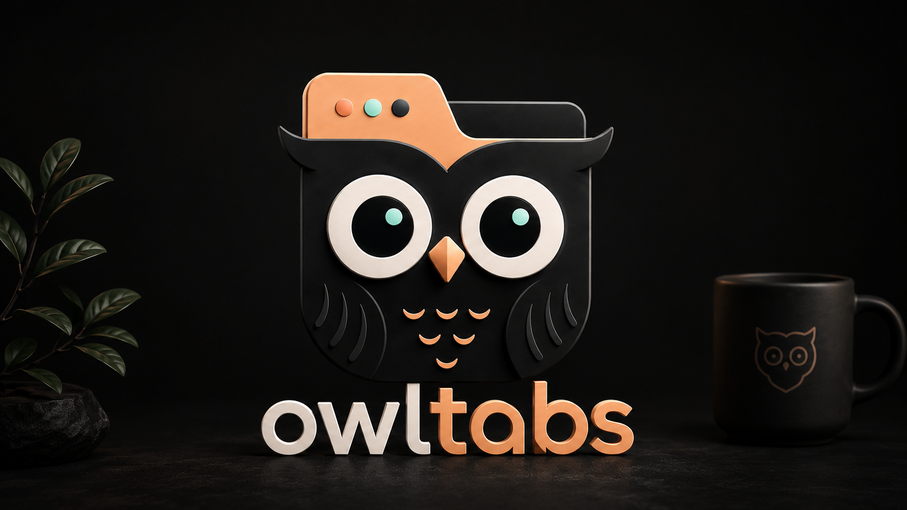
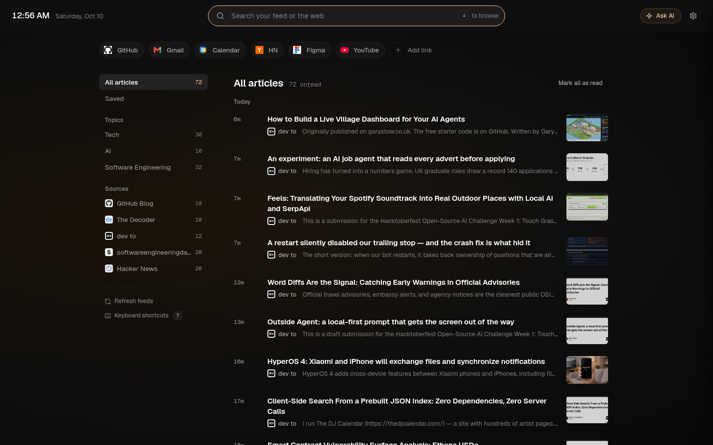

# OwlTabs

<p align="center">
  
</p>

A keyboard-first new tab for Chrome and Brave. Open a tab and you can search, jump to a site, or scan what's new in your RSS feeds, with a Gemini-powered assistant on the side when you want one.

<p align="center">
  
</p>

## Features

- **Reader layout.** Articles from all your feeds in one list, grouped by day (Today, Yesterday, This week, Older), with more loading as you scroll.
- **Sources sidebar.** Filter by topic or by feed, with unread counts. Saved articles have their own view.
- **Read tracking.** Articles you open are marked read and dimmed, and this persists across tabs. Mark everything in a view as read in one click.
- **Search that does two things.** Typing filters the article list as you go. Press Enter to search the web instead, or Ctrl/⌘ + Enter to ask the AI.
- **Ready to type.** The search box has the cursor when a new tab opens (optional; see [New-tab focus](#new-tab-focus)).
- **Keyboard navigation.** Move through articles with `j`/`k` or the arrow keys, then open, save, mark read, or ask AI without touching the mouse. Press `?` for the full list.
- **Quick links.** Pinned sites above the feed. Drag to reorder, hover to remove (with undo).
- **AI assistant.** A side panel that summarizes your feed, finds trends, and answers questions about articles, using Gemini with your own API key. Press `a` on any article to ask about it.
- **Settings.** Manage feeds (refresh interval, article limit, on/off), quick links, search engine, text size, accent color, thumbnails, clock, and data export or reset.
- **Starter feeds.** With no feeds yet, add suggested ones in a click or paste any RSS or Atom URL.

## Install from source

```bash
pnpm install
pnpm run build
```

Then load the `dist/` folder as an unpacked extension:

1. Open `chrome://extensions`
2. Turn on **Developer mode**
3. Click **Load unpacked** and select the `dist/` folder
4. Open a new tab

After rebuilding, click the reload icon on the extension's card in `chrome://extensions` to pick up changes.

## Keyboard shortcuts

Press `?` on the page to see these at any time.

**Articles** (when the search box isn't focused)

| Key | Action |
| --- | --- |
| `j` or ↓ | Next article |
| `k` or ↑ | Previous article (↑ on the first one returns to search) |
| `o` or `Enter` | Open |
| `s` | Save or unsave |
| `m` | Mark read or unread |
| `a` | Ask AI about the article |

**Anywhere**

| Key | Action |
| --- | --- |
| `/` or Ctrl/⌘ + `K` | Focus search |
| ↓ in an empty search box | Move to the article list |
| `Enter` in search | Search the web |
| Ctrl/⌘ + `Enter` in search | Ask AI |
| Ctrl/⌘ + `/` | Open or close the AI panel |
| Ctrl/⌘ + `,` | Settings |
| `1` to `9` | Open a quick link |
| `?` | Keyboard shortcuts |
| `Esc` | Close the open panel, or clear the search |

## New-tab focus

Chrome gives the address bar focus on new-tab pages, and an extension can't take it back. With **Settings → General → Focus search on new tab** turned on (the default), OwlTabs reloads itself once so the search box gets the cursor. The trade-off is that the address bar shows the extension's URL instead of being empty. Turn the setting off to keep Chrome's default behavior.

## AI assistant

1. Get a free API key from [Google AI Studio](https://aistudio.google.com/apikey).
2. Open **Settings → AI assistant**, turn it on, paste the key, and click **Save key**.
3. Click **Ask AI** in the header, press Ctrl/⌘ + `/`, or press `a` on an article.

The key is stored in your browser's sync storage and requests go straight from the page to Google's API.

## Development

```bash
pnpm run build          # build into dist/
pnpm exec tsc --noEmit  # typecheck (the Vite build doesn't)
```

There is no test suite yet; `pnpm test` is a placeholder.

- `src/newtab/` is the new-tab page; `src/background/` is the service worker that fetches feeds.
- [`DESIGN.md`](DESIGN.md) documents the design system: tokens, layout, components, motion, and keyboard behavior.
- [`docs/specs/V2.md`](docs/specs/V2.md) is the earlier v2 spec. Parts of its layout (card grid, full-page AI) have since been replaced by the reader layout described in `DESIGN.md`.

## Tech stack

- TypeScript and Vite, Manifest V3
- Vanilla DOM rendering, no UI framework
- CSS custom properties built on the Vesper design tokens, with Geist and Geist Mono
- Gemini REST API for the assistant, rendered with `marked` and `dompurify`
- SortableJS for reordering quick links

## License

[MIT](LICENSE)
